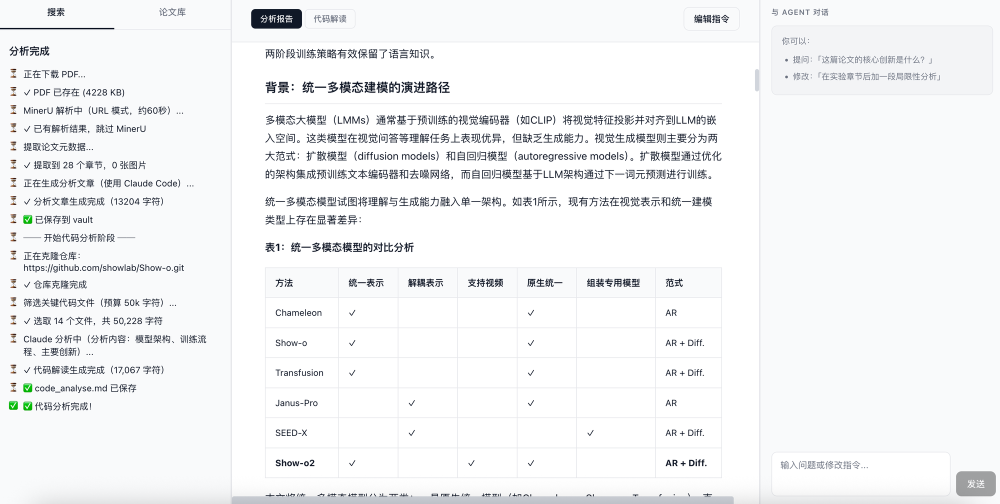
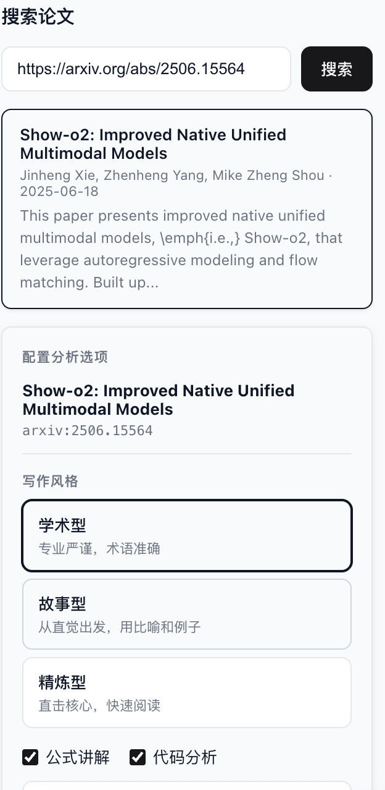
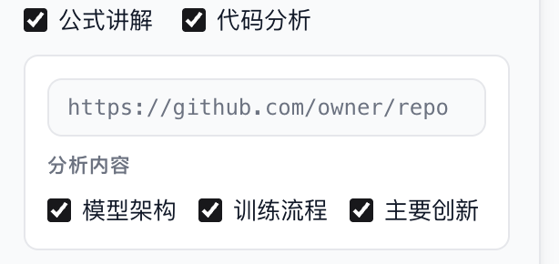
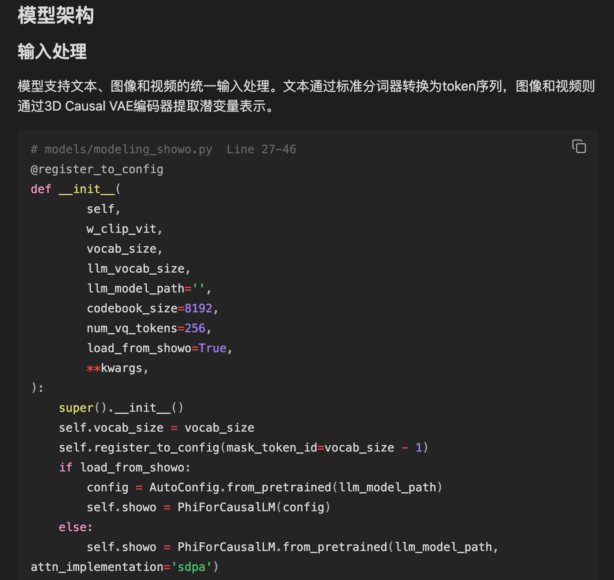
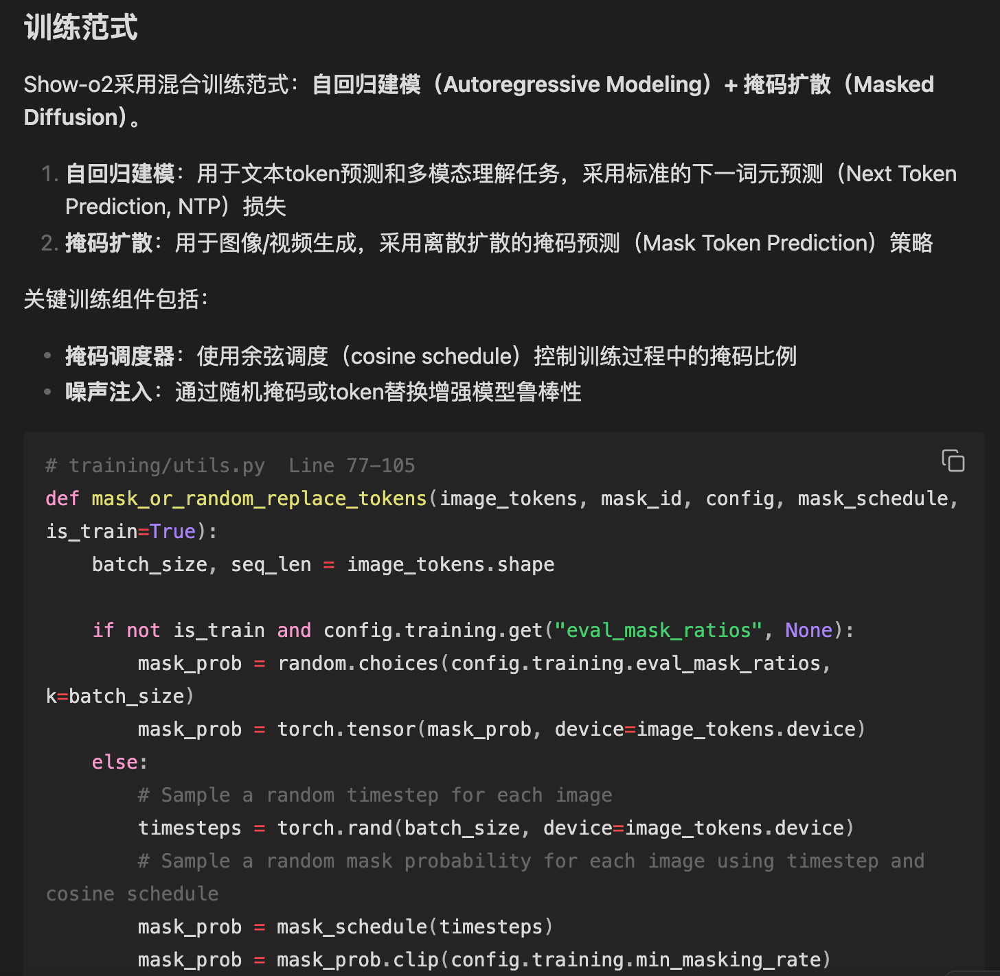
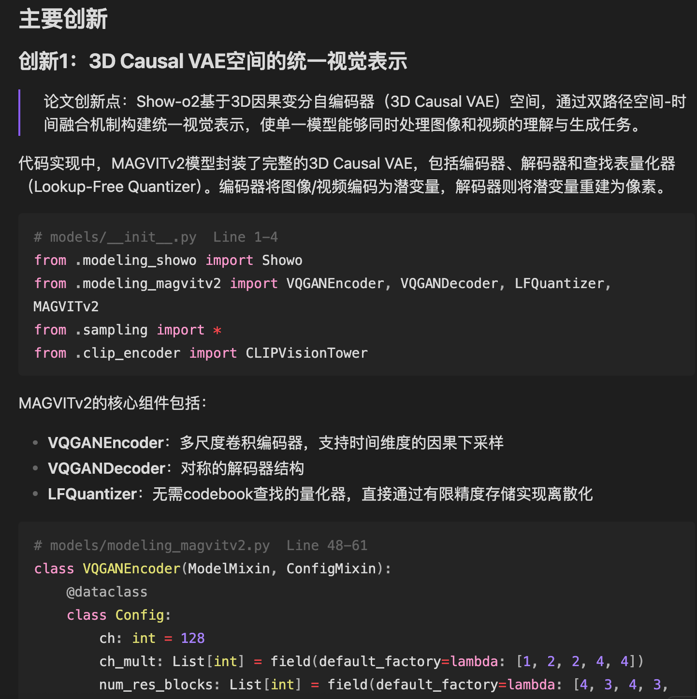

# ResearchPaper-Analyzer 📄✨

> 🔬 **只需粘贴论文链接，深度技术文章自动生成。** PDF 自动下载，MinerU 高精度解析，Claude 深度分析——图片、表格、公式一应俱全，直接存入你的 Obsidian 知识库。
>
> 🔗 **附上 GitHub 仓库，获得代码级解读。** 精确定位每个核心创新点对应的文件名与行号，拆解模型架构与训练流程，配套真实代码片段。
>
> *💡 从 URL 到结构化知识，一键直达。🌱*

<p align="center">
  
</p>

---

## 🎯 核心功能

粘贴 arxiv 链接 → 配置选项 → 获得深度技术文章，包含：

- **MinerU 解析的图片与实验表格**，完整嵌入文章
- **LaTeX 公式** KaTeX 实时渲染
- **三种写作风格**：学术型 / 故事型 / 精炼型
- **代码级分析**（可选）：模型架构、训练流程、核心创新——精确到文件与行号
- **自动存入 Obsidian**，携带完整 YAML frontmatter（标题 / 作者 / arxiv / 标签）
- **Agent 对话**：分析完成后继续提问或要求修改

---

## 🏆 核心优势

### 1. 📚 与 Obsidian 深度集成，打造个人论文知识库

所有分析结果自动保存至 Vault，携带完整 YAML frontmatter，可在 Obsidian 中直接浏览、检索和双向链接。论文库支持按 Tag 筛选，文献管理井然有序。

```
vault/03_资源/科研/papers/
└── {论文标题}/
    ├── analysis.md       # 含 Obsidian frontmatter，可直接在 Obsidian 打开
    ├── code_analyse.md   # 代码深度解读（可选）
    ├── paper.pdf
    └── raw/images/       # 论文图片，analysis.md 中直接引用
```

### 2. 🖼️ 图文并茂的深度技术文章，而非简单摘要

MinerU 高精度提取论文中的图片、表格和公式，生成的文章将其完整嵌入，保留原始论文的视觉证据，呈现有深度、有结构的技术解读。

### 3. 🔍 联动 GitHub 仓库，代码级创新点定位

提供仓库链接后，Claude 将：

- 筛选关键源码文件（50k token 预算）
- **精确定位每个创新点的代码实现**——文件名 + 行号范围
- 结合真实的 `__init__` 和 `forward` 代码解释模型架构
- 梳理训练循环、损失函数与数据处理流程

> 分析维度自由选择：模型架构 · 训练流程 · 主要创新

---

## 📸 界面预览

### 搜索与配置

输入 arxiv 链接或标题，选择写作风格，开启公式讲解与代码分析：

<p align="center">
  
  &nbsp;&nbsp;
  
</p>

### 分析报告

左侧实时展示每阶段进度，右侧渲染含图片、表格、公式的完整技术文章，右上角可与 Agent 对话：

<p align="center">
  
</p>

### 代码深度解读

模型架构、训练范式、主要创新，每项均附精确文件 + 行号引用：

<p align="center">
  
</p>

<p align="center">
  
</p>

<p align="center">
  
</p>

---

## 🧩 依赖 Skill：paper-analyzer

本项目的后端 AI 分析能力由 **paper-analyzer** Claude Code skill 驱动，需要提前安装。

### Skill 功能

| 能力 | 说明 |
|------|------|
| MinerU Cloud API 解析 | 高精度提取论文正文、图片、表格、LaTeX 公式 |
| 多写作风格 | 学术型 / 故事型 / 精炼型，可在 `.env` 或前端切换 |
| 公式讲解 | 插入公式图片并详细解读符号含义 |
| 代码分析 | 结合 GitHub 仓库，定位创新点实现代码位置 |
| Markdown + HTML 输出 | 图片以 base64 嵌入，可离线查看 |

### Skill 结构

```
paper-analyzer/
├── SKILL.md                  # skill 定义与使用说明
├── requirements.txt          # Python 依赖
├── scripts/
│   ├── mineru_api.py         # MinerU Cloud API 客户端
│   ├── extract_paper_info.py # 论文元数据提取
│   ├── generate_html.py      # HTML 渲染
│   └── convert_pdf.py        # PDF 工具
└── styles/
    ├── academic.md           # 学术型写作风格提示词
    ├── storytelling.md       # 故事型写作风格提示词
    ├── concise.md            # 精炼型写作风格提示词
    ├── with-formulas.md      # 公式讲解提示词
    ├── no-formulas.md        # 无公式提示词
    ├── with-code.md          # 代码分析提示词
    └── no-code.md            # 无代码提示词
```

### 安装方法

```bash
# 1. 克隆 skill 到 Claude Code skills 目录
git clone https://github.com/aba122/ResearchPaper-Analyzer.git
cp -r ResearchPaper-Analyzer/skills/paper-analyzer ~/.claude/skills/

# 2. 安装 skill 的 Python 依赖
pip install -r ~/.claude/skills/paper-analyzer/requirements.txt
```

> 如果你的 `~/.claude/skills/` 目录下已经有 paper-analyzer，可跳过此步骤。
> 后端通过 `PAPER_ANALYZER_SCRIPTS_DIR` 和 `PAPER_ANALYZER_STYLES_DIR` 环境变量定位 skill 路径，
> 默认为 `~/.claude/skills/paper-analyzer/scripts` 和 `~/.claude/skills/paper-analyzer/styles`。

---

## 🚀 快速部署

### 环境要求

| 依赖 | 说明 |
|------|------|
| **Python** | 必须使用 miniconda Python（需 OpenSSL 3.0，避免 SSL 错误）|
| **Node.js** | 用于 Vite 前端构建 |
| **MinerU Token** | 注册 MinerU Cloud 获取，填入 `.env` |
| **Claude Code** | `claude` CLI 已通过 OAuth 登录，无需 `ANTHROPIC_API_KEY` |

### 安装与启动

```bash
# 1. 克隆项目
git clone <repo-url> ResearchPaper-Analyzer
cd ResearchPaper-Analyzer

# 2. 配置环境变量
cp .env.example .env
# 编辑 .env，填入 MINERU_TOKEN

# 3. 安装后端依赖（必须使用 miniconda Python）
cd backend
/path/to/miniconda3/bin/python3 -m venv venv
venv/bin/pip install -r requirements.txt
cd ..

# 4. 安装前端依赖
cd frontend && npm install && cd ..

# 5. 启动
./start.sh
```

访问 **http://localhost:5173**

> `start.sh` 自动检测 OpenSSL 版本、清理残留进程、禁用代理（防止 MinerU API 握手失败）。

```bash
./restart.sh   # 强制清理所有进程后重启
```

---

## 📖 使用方式

**第一步 — 搜索论文**

支持以下任意输入方式：
- 论文标题关键词 → `Show-o2`
- arxiv ID → `2506.15564`
- 完整链接 → `https://arxiv.org/abs/2506.15564`

**第二步 — 配置分析选项**

| 选项 | 说明 |
|------|------|
| **写作风格** | 学术型 / 故事型 / 精炼型，三选一 |
| **公式讲解** | 对关键数学公式展开解释 |
| **代码分析** | 填入 GitHub 仓库链接后开启 |
| **分析内容** | 可选：模型架构 · 训练流程 · 主要创新点 |

**第三步 — 等待分析完成**

```
✓ PDF 已存在 (4228 KB)
✓ 已有解析结果，跳过 MinerU
  提取论文元数据...
✓ 提取到 28 个章节，0 张图片
  正在生成分析文章（使用 Claude Code）...
✓ 分析文章生成完成（13,204 字符）
✅ 已保存到 vault
—— 开始代码分析阶段 ——
  正在克隆仓库: https://github.com/showlab/Show-o.git
✓ 仓库克隆完成
✓ 筛选关键代码文件（预算 50k 字符）— 选取 14 个文件，共 50,228 字符
  Claude 分析中（模型架构 · 训练流程 · 主要创新）...
✓ 代码解读生成完成（17,067 字符）
✅ code_analyse.md 已保存
✅ 代码分析完成！
```

**第四步 — 阅读与交互**

- **分析报告** 标签页——含图片、表格、公式的完整技术文章
- **代码解读** 标签页——架构解析 + 训练流程 + 创新点代码定位
- **与 Agent 对话**（右上角）——提问或要求修改，例如「在实验章节后加一段局限性分析」
- **论文库**——浏览所有已分析论文，支持 Tag 筛选

---

## 🛠 技术栈

| 层 | 技术 | 说明 |
|---|------|------|
| 前端 | React + Vite | 单页应用，Markdown-it + KaTeX 渲染 |
| 后端 | FastAPI | SSE 流式输出，uvicorn 热重载 |
| AI 分析 | Claude Code CLI | OAuth 登录，无需 API Key |
| PDF 解析 | MinerU Cloud API | 高精度提取图文表格公式 |
| 知识库 | Obsidian YAML frontmatter | tags / title / authors / arxiv |

---

## ❓ 常见问题

**MinerU SSL 错误** → 确保使用 miniconda Python（OpenSSL 3.0），`start.sh` 已自动处理

**端口冲突** → 运行 `./restart.sh`

**arxiv 搜索 429** → 直接输入 arxiv 完整链接，绕过搜索 API

**MinerU 解析超时** → 重试即可，已有 `batch_id` 自动恢复

**venv 使用了错误的 Python** → 手动重建：
```bash
cd backend
rm -rf venv
/path/to/miniconda3/bin/python3 -m venv venv
venv/bin/pip install -r requirements.txt
```

---

## 📄 License

MIT
